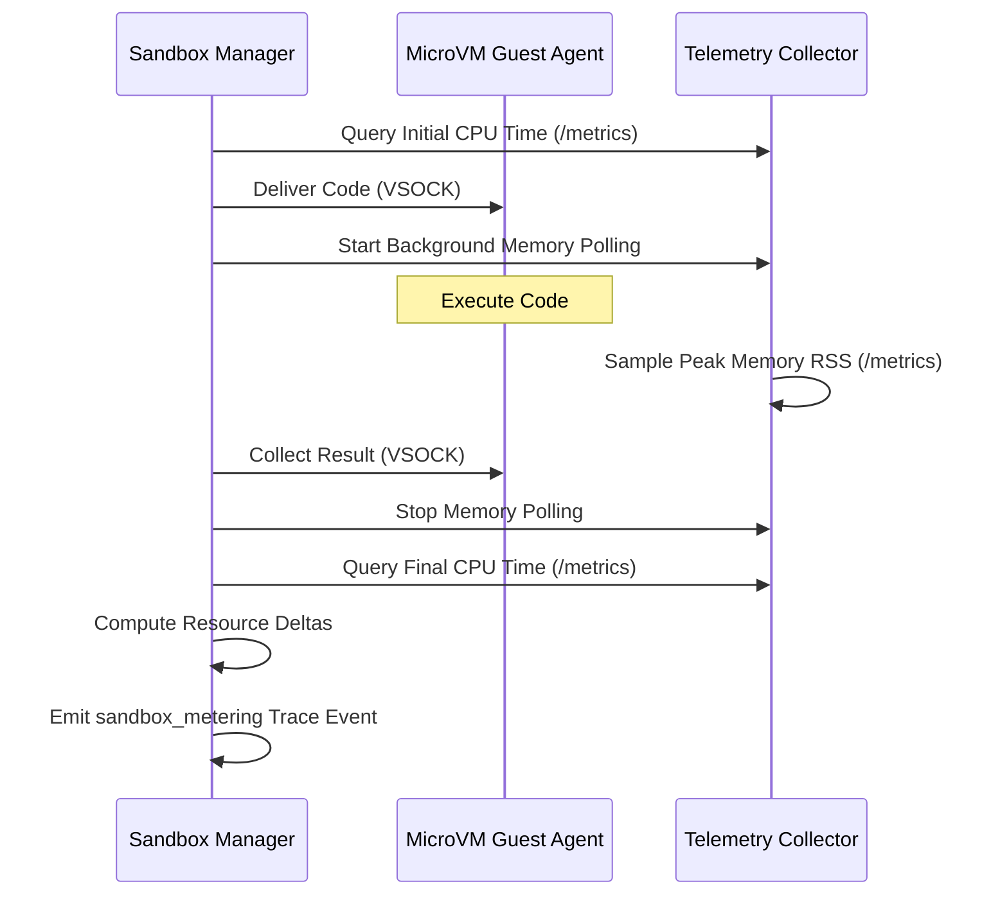

# Sandbox Resource Metering & Telemetry

Strake provides built-in resource metering and telemetry for Python code executed inside its Firecracker microVM sandboxes. This allows you to monitor, attribute, and control guest CPU time, peak memory usage, and wall-clock execution durations in real time.

---

## Key Metrics Monitored

For each sandbox execution, Strake captures three primary dimensions of resource utilization:

| Metric | Unit | Description | Collection Method |
| :--- | :--- | :--- | :--- |
| **CPU Time (`cpu_seconds`)** | Seconds | Cumulative guest user + system CPU duration consumed by the execution. | Prometheus counter diff |
| **Peak Memory (`max_memory_mb`)** | MiB | Peak guest memory (RSS) consumed during the execution window. | Background polling loop |
| **Wall Clock (`wall_duration_seconds`)** | Seconds | Monotonic duration of the execution window as seen by the host. | Host system clock |

---

## Architecture Overview

Resource metering is fully integrated into the modular Firecracker sandbox pipeline:



1. **Baseline Query**: Before code delivery, the orchestrator queries the Firecracker metrics UDS endpoint to establish baseline CPU usage.
2. **Background Memory Polling**: A dedicated asyncio sampling task queries guest balloon memory usage at regular intervals to capture peak memory RSS.
3. **Completion Query**: Upon execution completion, a final metrics endpoint query computes total CPU delta.
4. **Structured Trace Emission**: Emits a structured `sandbox_metering` trace event via the tracing framework facade.

---

## Configuration

Sandbox resource metering is configurable via environment variables:

### `STRAKE_METERING_INTERVAL`
- **Description**: Sets the interval (in seconds) at which the background memory polling task samples the microVM's metrics UDS.
- **Type**: `float`
- **Default**: `2.0` (2 seconds)
- **Usage**:
  ```bash
  export STRAKE_METERING_INTERVAL=0.5
  ```

> [!TIP]
> Lower values (e.g. `0.1` - `0.5`) provide highly precise peak memory captures for short-lived tasks at the cost of slight CPU overhead on the metrics socket. Higher values are recommended for long-running batch execution profiles.

---

## Consuming Metering Telemetry

All microVM metering data is emitted via structured `TraceEmitter` events. You can consume these events by registering a custom telemetry listener or configuring standard trace sinks.

### Metering Trace Event Schema
```json
{
  "event": "sandbox_metering",
  "session_id": "8a63145b-18f6-4875-96e0-64b5e3ae7135",
  "cpu_seconds": 0.125,
  "max_memory_mb": 64.0,
  "wall_duration_seconds": 0.352
}
```

### Accessing Metrics Logically

If you instantiate `FirecrackerSandboxManager` directly, you can access the telemetry results through the tracing listener interface or check log files:

```python
import asyncio
from strake.sandbox.firecracker import FirecrackerSandboxManager
from strake.tracing import get_emitter

async def run_monitored_sandbox():
    # Metering data is automatically gathered and emitted to the global emitter
    async with FirecrackerSandboxManager(db_connection) as manager:
        result = await manager.run("print('Hello Monitored World')")
        print(f"Stdout: {result.stdout}")

asyncio.run(run_monitored_sandbox())
```

> [!IMPORTANT]
> The sandbox metering collector incorporates robust, signal-resilient exception boundaries. If a microVM crashes or the UDS metrics endpoint is abruptly closed, the sandbox runner will safely log a warning and fallback to baseline metering (`0.0`), guaranteeing that your query execution remains uninterrupted.
