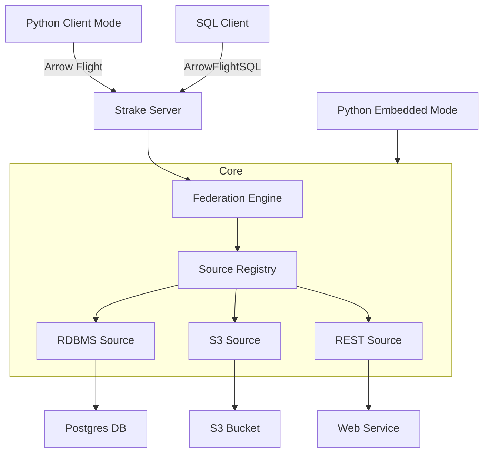

# Internal Architecture

This document provides a deep dive into the internal components of Strake.

## System Overview

Strake is built as a set of modular Rust crates, orchestrated to provide a seamless SQL experience.

## Key Components

### 1. `strake-core`
The brain of the operation. It depends on `datafusion` and implements the `FederationEngine`.
*   **`FederationEngine`**: configuring the DataFusion `SessionContext`.
*   **`SourceRegistry`**: Dynamically loads and manages `SourceProvider` implementations.

### 2. `strake-server`
The "Face" of Strake. It implements the **Apache Arrow Flight SQL** protocol.
*   **Tonic/gRPC**: Handles the network transport.
*   **AuthLayer**: Middleware for checking API Keys or OIDC Tokens.
*   **FlightSqlService**: Maps Flight SQL commands (`GetFlightInfo`, `DoGet`) to DataFusion execution plans.

### 3. `strake-python`
The Python bindings.
*   **PyO3**: Wraps the Rust `strake-core` and `flight-client` logic.
*   **Zero-Copy**: Converts Rust `RecordBatch` structures directly to Python `PyArrow` tables without serialization overhead.

## Data Flow

### Anatomy of a Query

1.  **Submission**: Client sends a SQL query string via `CommandStatementQuery`.
2.  **Planning**: `FederationEngine` uses DataFusion's SQL parser and planner.
3.  **Optimization**:
    *   **Logical Optimizer**: Applies specific rules, including Pushdown.
    *   **Physical Planner**: Converts the plan into an execution graph.
4.  **Execution**:
    *   Scan nodes read data from sources (Postgres, S3, etc.).
    *   Data flows through the graph (Filter, Project, Join, Aggregate) as Arrow RecordBatches.
5.  **Response**: The result batches are streamed back to the client via Flight `DoGet`.

## Table Provider Interface

Each Source Type implements the `TableProvider` trait (from DataFusion):

## Scaling Strategy

Strake is designed to scale from a single developer laptop to an enterprise cluster handling thousands of concurrent AI agents.

### 1. Vertical Scaling (Compute Bound)
*   **Use Case:** Large `GROUP BY` or `JOIN` operations on millions of rows *returned* from sources (i.e., when pushdown is not possible).
*   **Mechanism:** Increase CPU/RAM on the single `strake-server` instance.
*   **Limits:** Limited by the largest available single machine.

### 2. Horizontal Scaling (Concurrency Bound)
*   **Use Case:** High throughput of concurrent queries from thousands of AI agents (e.g., "Get me the latest sales" x 5000 agents).
*   **Mechanism:** **Stateless Auto-Scaling**.
    *   Run `N` replicas of `strake-server` behind a Layer 4/7 Load Balancer.
    *   **Shared State:**
        *   **Metadata:** All replicas read `sources.yaml` or connect to the same Postgres Metadata Store.
        *   **Auth Cache:** (Enterprise) Use Redis for distributed API key caching instead of local memory.
        *   **Rate Limits:** (Enterprise) Use Redis-backed "Traffic Control" middleware to enforce global quotas.
*   **Result:** Linearly scale **QPS (Queries Per Second)** by adding more stateless nodes.

### 3. Hybrid Scaling / Vertical Resilience (Spill-to-Disk)
*   **Use Case:** Process datasets larger than RAM on a single node without OOM crashes (e.g. joining 50GB Parquet files on a 16GB RAM node).
*   **Mechanism:** **DataFusion Disk Manager**.
    *   Configure `memory_limit_mb` (e.g. 80% of RAM).
    *   Strake automatically spills excess data to a mounted scratch disk (SSD) during memory-intensive operations (Hash Joins, Aggregations).
*   **Result:** Crash resilience for "Big Data" queries without the complexity of a distributed shuffle cluster.

### 4. Distributed Compute (Explicitly Deferred)
*   *Note: Distributed shuffle clusters (Apache Ballista/Spark/Ray) are explicitly deferred. Strake favors "Defensive Federation" (Pushdown) and "Hybrid Scaling" (Spill-to-Disk) to maintain a single-binary architecture.*
