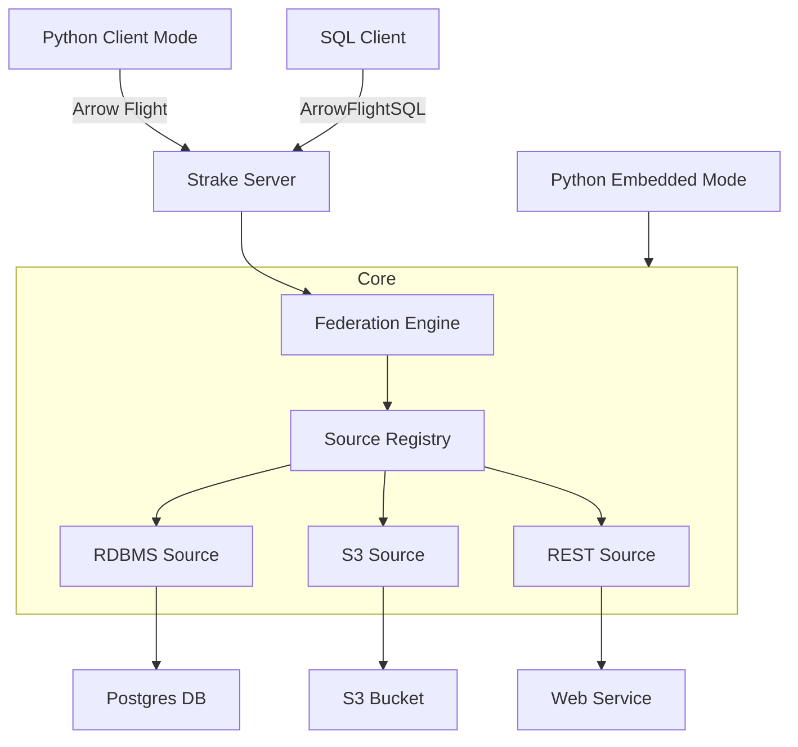

# Welcome to Strake

Strake is the AI Data Layer: a sandboxed execution environment where AI agents meet your data and return answers, not rows.

---

## Getting Started

Explore Strake using these primary entry points:

1. **[Get Started](getting-started/)** - Quickstart tour and step-by-step installation guides.
2. **[Connect a Data Source](user-guide/sources/)** - Comprehensive connector setups for PostgreSQL, S3, REST, and more.
3. **[Explore the CLI](user-guide/cli/)** - GitOps validation, db migrations, and API key management commands.

---

## System Architecture Overview

Strake operates as a zero-copy data federation mesh using standard Apache Arrow Flight SQL connectivity.

---

## Key Features

* **High Performance**: Sub-second latency for federated joins using Apache Arrow.
* **Pluggable Sources**: Postgres, S3, Local Files, REST, gRPC, and more.
* **Enterprise Governance**: Row-Level Security (RLS), Column Masking, and OIDC Authentication (see [Enterprise Edition](advanced/enterprise.md)).
* **Python Native**: Zero-copy integration with Pandas and Polars via PyO3.
* **Observability**: Built-in OpenTelemetry tracing and Prometheus metrics.
* **Federation Examples**: Check out [Examples](examples/) to see cross-source joins in action.
