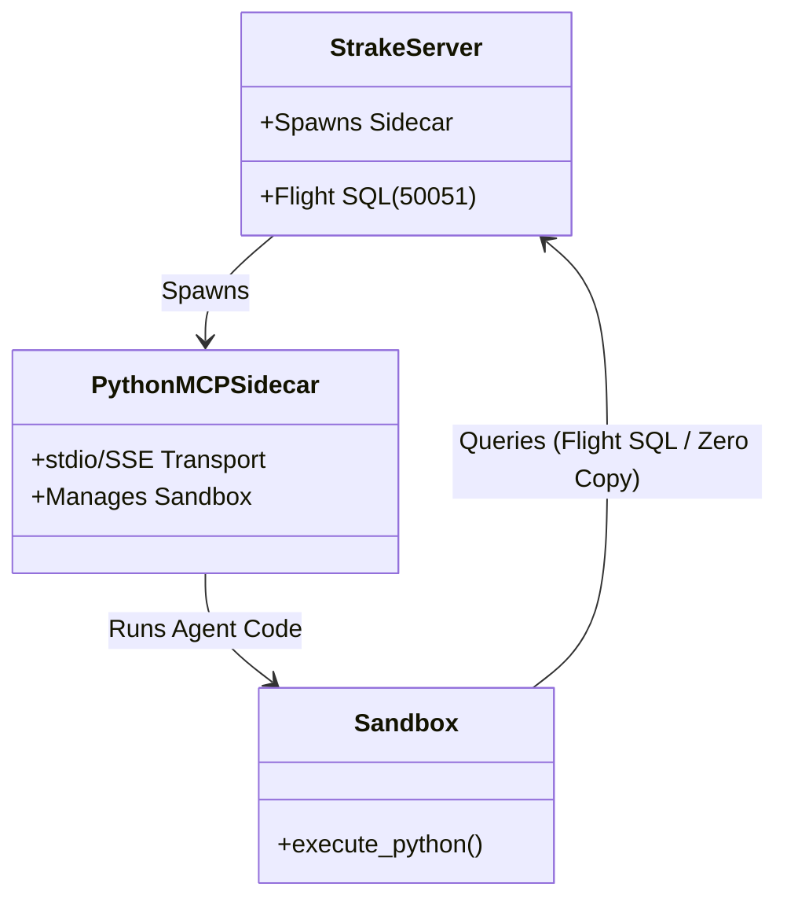

# Running Strake Server with MCP Integration

The Strake Federation Engine now supports a hybrid **Python Sidecar MCP** architecture. This allows AI agents (like Claude Desktop or the OpenAI SDK) to interact seamlessly with your data sources using the Model Context Protocol.

## Architecture

We use a **Code Mode** architecture. Instead of exposing hundreds of individual "tools" to the LLM context, we expose a single tool: a sandboxed Python runtime (`run_python`).

When you enable the MCP feature, the Rust server (`strake-server`) acts as a "Supervisor." It automatically spans a child Python process running the `strake.mcp` module, which manages the sandbox.



## Prerequisites

1.  **Rust Toolchain**: To build the server.
2.  **Python Environment**: The server requires `python3` (or `python`) in the path with the `strake` library installed.

```bash
# Install the python bindings
cd python
pip install .
```

## Running the Server

Start the Enterprise server with the `--mcp` flag:

```bash
# From workspace root
cargo run -p strake-enterprise -- --config config/strake.yaml --mcp
```

### Verification
You should see logs indicating the sidecar has started:
```text
INFO Starting MCP Sidecar...
INFO Spawning MCP Agent: python3 -m strake.mcp --transport sse
```

## connecting an Agent (Example: OpenAI)

We provide a sample OpenAI agent script demonstrating how to connect to this MCP server over `stdio` (or you can connect to the running sidecar if you adjusted the mode).

### 1. Configure the Agent

Edit `mcp/openai_strake_agent.py` to ensure it points to your server:

```python
    env={
        **os.environ,
        "STRAKE_URL": "grpc://127.0.0.1:50051", 
    }
```

### 2. Run the Agent

**Note:** The agent script itself runs the MCP server as a *subprocess* (Stdio Mode). This is useful for standalone agent scripts that don't need the full `strake-enterprise` server running in the background, OR if they are connecting to a remote server passed via `STRAKE_URL`.

```bash
# Install dependencies
pip install mcp openai azure-identity

# Run the agent
python mcp/openai_strake_agent.py
```

## Claude Desktop Integration

To add Strake to Claude Desktop, edit your `claude_desktop_config.json`:

```json
{
  "mcpServers": {
    "strake": {
      "command": "python",
      "args": [
        "-m",
        "strake.mcp"
      ],
      "env": {
        "STRAKE_URL": "grpc://127.0.0.1:50051"
      }
    }
  }
}
```

*Ensure that the `strake-enterprise` server is running separately on port 50051 so the sidecar can connect to it.*
