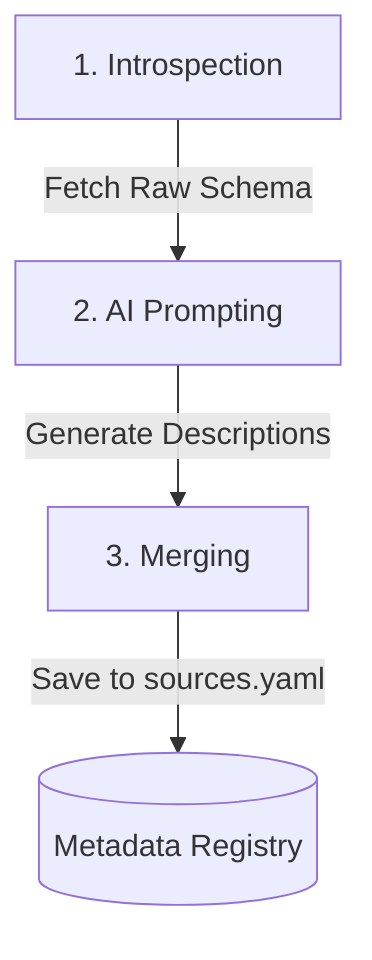

# AI-Powered Metadata Enrichment

Strake provides built-in capability to automatically enrich your data source schema metadata with natural language descriptions using advanced language models (LLMs). 

When querying data through AI agents, having high-quality, semantic metadata (descriptions of what columns and tables represent) is crucial. Strake enables you to automatically generate these descriptions when discovering and adding tables to your registry.

---

## How It Works

AI Metadata Enrichment operates in a three-stage lifecycle during data source discovery:



### 1. Introspection
Strake first queries the upstream database or API to inspect the technical schema. It retrieves physical metadata including:
*   Table name
*   Column names
*   Data types (e.g., `VARCHAR`, `INT`, `TIMESTAMP`)
*   Key constraints (e.g., Primary Keys, Foreign Keys)

### 2. Prompting
Strake constructs a semantically rich prompt containing the physical schema, constraints, and context. It sends this to your configured AI provider (e.g., Gemini or OpenAI), instructing it to generate concise, human-readable natural language descriptions of what each table and column represents.

### 3. Merging
The generated descriptions are returned and merged back into your local `sources.yaml` file. By default, Strake acts defensively to protect your manual annotations:
*   **Merge Mode (Default)**: Existing manual descriptions are fully preserved. The AI only fills in blank/missing descriptions.
*   **Overwrite Mode**: The AI will regenerate and replace all descriptions, which is useful when a schema changes significantly.

---

## Configuration

You can configure the AI provider and model using either your `strake.yaml` file or environment variables.

### 1. File Configuration (`strake.yaml`)

Add the `ai:` configuration block to your primary `strake.yaml`:

```yaml
# AI description generation configuration
ai:
  # The AI provider to use ('gemini' or 'openai')
  provider: gemini
  
  # The specific LLM model to target
  model: gemini-3.5-flash
  
  # Sampling temperature for generating variety (0.0 to 1.0)
  temperature: 0.7
  
  # (Optional) Custom API gateway endpoint URL
  url: "https://generativelanguage.googleapis.com"
```

### 2. Environment Variable Configuration

Environment variables take highest priority and are ideal for credentials or CI/CD pipelines:

| Environment Variable | Description |
| :--- | :--- |
| `STRAKE_AI_PROVIDER` | AI provider for metadata enrichment (`gemini`, `openai`). |
| `STRAKE_AI_MODEL` | Overrides the AI model used for descriptions. |
| `GOOGLE_API_KEY` | API key required for the Gemini provider. |
| `OPENAI_API_KEY` | API key required for the OpenAI provider. |

---

## CLI Usage

To enrich metadata, use the `--ai-descriptions` flag with the `strake-cli add` command.

### Introspect & Enrich a Specific Table
To introspect a table from a source and generate AI descriptions:
```bash
strake-cli add pg_production public.users --ai-descriptions
```

### Bulk Add with AI Descriptions
To add all tables in a specific schema with AI descriptions:
```bash
strake-cli add pg_production --pattern "public.*" --ai-descriptions
```

### Re-generating/Overwriting Descriptions
To refresh descriptions for a table that has already been registered, use the `--overwrite` flag. This will replace any manual edits:
```bash
strake-cli add pg_production public.users --ai-descriptions --overwrite
```

### Dry Run (Preview Changes)
To preview the generated descriptions and see how the `sources.yaml` file would be updated without actually saving the changes:
```bash
strake-cli add pg_production public.users --ai-descriptions --dry-run
```
