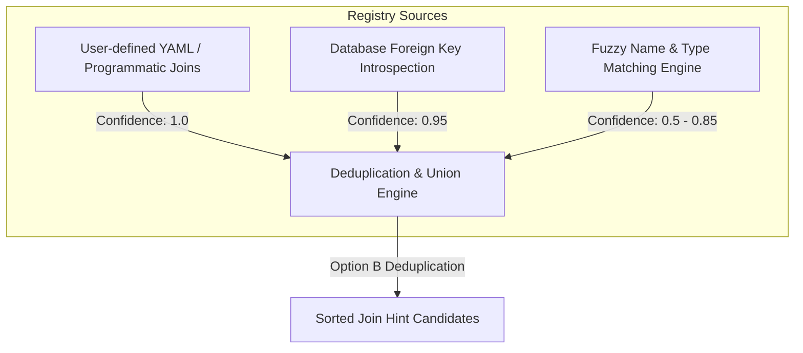

# Join Hints System

The Strake Join Hints System is a cross-source relationship discovery engine. It helps users and AI agents automatically discover and resolve correct join keys when querying disparate database tables (e.g., joining PostgreSQL transactional tables with S3 clickstream logs).

---

## How It Works

Strake discovers join key candidates through three complementary layers, sorted by priority:



### 1. Manual User-Defined Joins (Priority: 1.0)
You can declare known joins statically in configuration or bulk-load them from a YAML file. These are treated as ground-truth relationships.

### 2. Database Foreign Key Metadata Sync (Priority: 0.95)
On schema indexing, Strake queries the constraints catalog (`information_schema.table_constraints`, `referential_constraints`, and `key_column_usage`) of active SQL sources (PostgreSQL, MySQL, and Snowflake). It extracts existing database relations, infers join keys, and determines cardinality (`1:1` vs `1:N`) based on primary/unique key constraints.

### 3. Fuzzy Name-Type Matching (Priority: 0.5 - 0.85)
If fuzzy matching is enabled, Strake performs a Cartesian product comparison of compatible table columns using:
- **Type Compatibility**: Restricts candidate pairs to compatible generic categories (e.g. numeric-to-numeric, string-to-string, date-to-date).
- **Name Similarity**: Scores names using a combination of Levenshtein distance ratios and token Jaccard similarity (which tokenizes snake_case and camelCase column names).
- **Confidence Scoring**: Confidence is calculated as:
  $$\text{Confidence} = 0.5 + (0.35 \times \text{Similarity Score})$$
  Fuzzy matches are capped at a maximum confidence score of `0.85`.

---

## Configuration & Usage

### 1. YAML Configuration

You can configure manual join relationships in a YAML file and register them to the engine:

```yaml
joins:
  - left_table: "pg.public.users"
    left_column: "id"
    right_table: "s3.orders"
    right_column: "user_id"
    cardinality: "1:N"

  - left_table: "pg.public.users"
    left_column: "id"
    right_table: "pg.public.profiles"
    right_column: "user_id"
    cardinality: "1:1"
```

To load this configuration file programmatically using the Python API:

```python
import strake

conn = strake.connect("strake.yaml")
# Bulk load joins from configuration
conn.register_join(config_path="path/to/joins.yaml")
```

### 2. Programmatic Python API

#### Registering a Join Programmatically:
```python
conn.register_join(
    left_table="pg.public.users",
    left_column="id",
    right_table="s3.orders",
    right_column="user_id",
    cardinality="1:N"
)
```

#### Querying Join Hints:
```python
# Returns a list of candidate join paths sorted by confidence descending
hints = conn.join_hints("pg.public.users", "s3.orders", enable_fuzzy=True)
print(hints)
```

**Example Output:**
```json
[
  {
    "left": "id",
    "right": "user_id",
    "confidence": 1.0,
    "cardinality": "1:N",
    "basis": "user_defined"
  }
]
```

### 3. Environment Variables
You can toggle fuzzy join hints globally by setting the following environment variable:
```bash
export STRAKE_ENABLE_FUZZY_JOINS="true"
```

---

## The Deduplication Rule (Option B)

When multiple discovery sources match the same column pair `(left_column, right_column)`, Strake merges them to avoid redundant recommendations:
1. **Deduplication**: We group matches by the exact left-to-right column mapping.
2. **Confidence Resolution**: We retain **only the highest confidence score** among the matching sources.
3. **Basis Classification**:
   - If only a single source discovered the pair, `basis` is set to that source (`user_defined`, `fk_metadata`, or `name_type`).
   - If multiple sources discovered the same pair, `basis` is resolved as `"mixed"` to indicate multi-source verification.

---

## MCP Server Integration

Strake exposes join key discovery to AI Agents using the Model Context Protocol (MCP):

### Tool: `get_join_hints`
Retrieves candidate join paths between two tables. Useful for agents deciding how to join two tables in generated SQL queries.

- **Parameters**:
  - `left_fqn` (string, required): Fully qualified name of the left table.
  - `right_fqn` (string, required): Fully qualified name of the right table.
  - `enable_fuzzy` (boolean, optional): Set to `true` to enable fuzzy column name matching.

**Agent Tool Call Example**:
```json
{
  "name": "get_join_hints",
  "arguments": {
    "left_fqn": "strake.operational_db.customers",
    "right_fqn": "strake.web_sessions.web_sessions",
    "enable_fuzzy": true
  }
}
```
